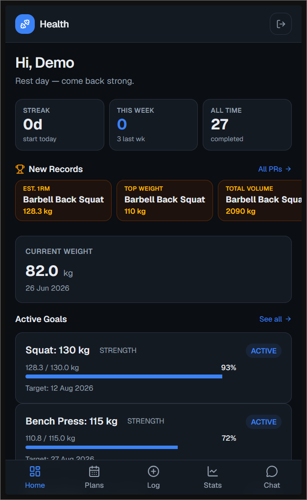
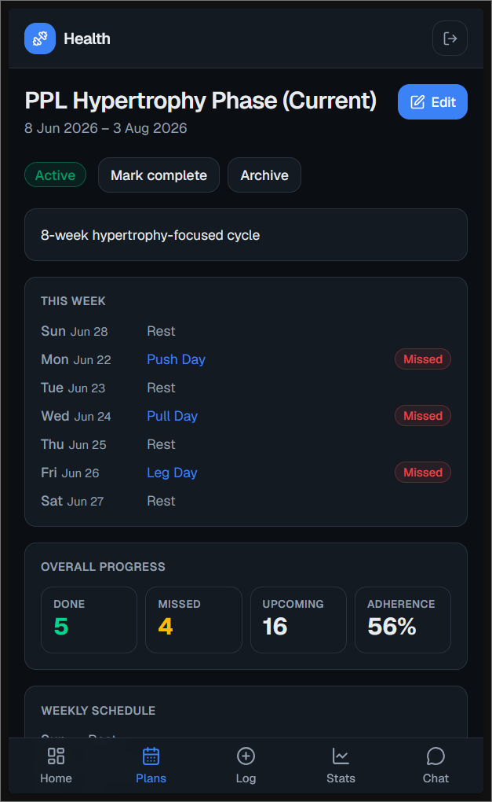
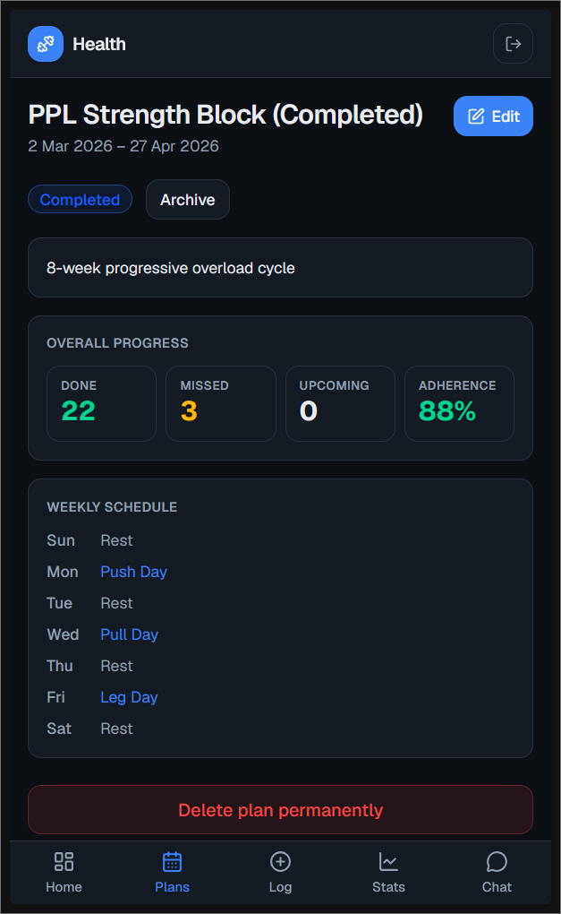
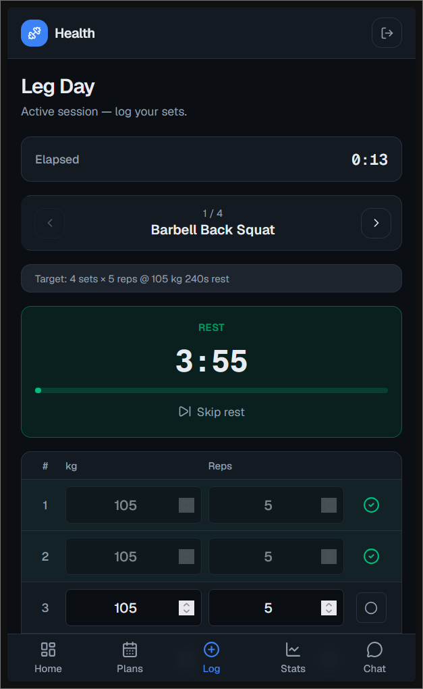
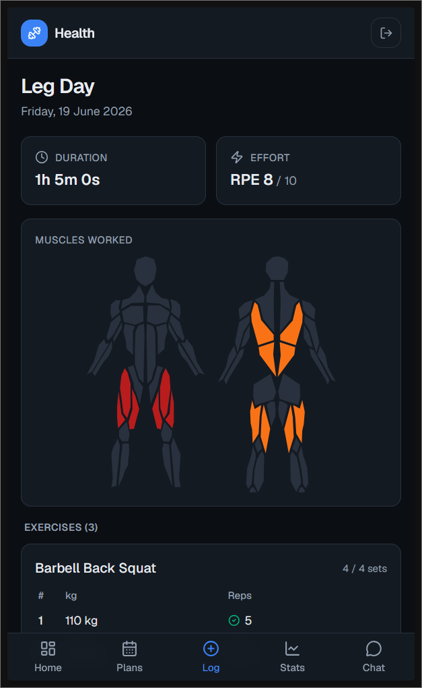
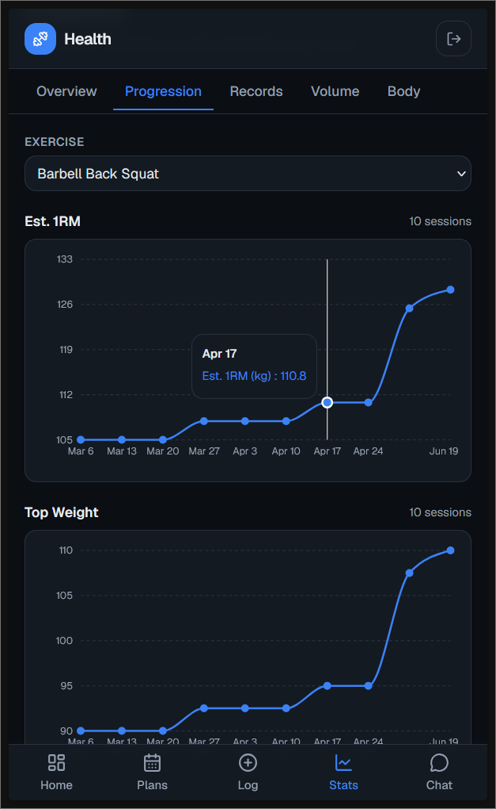
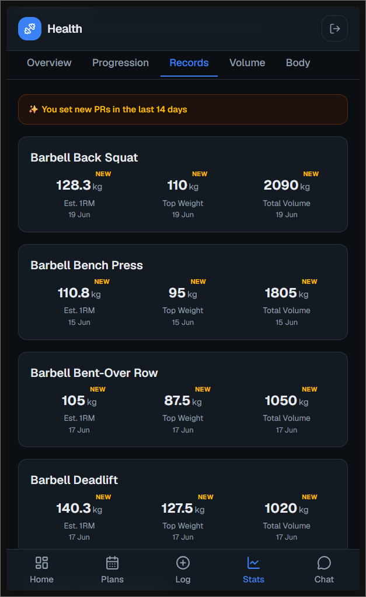
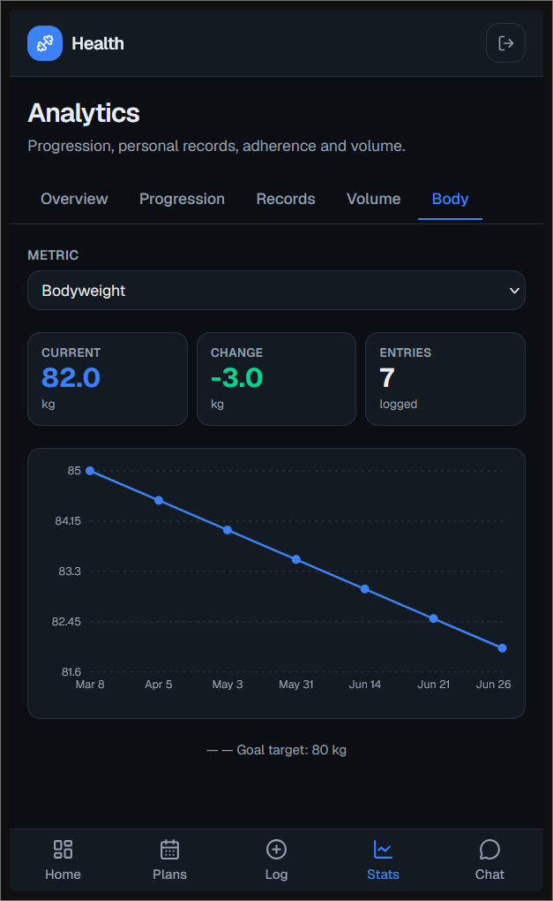
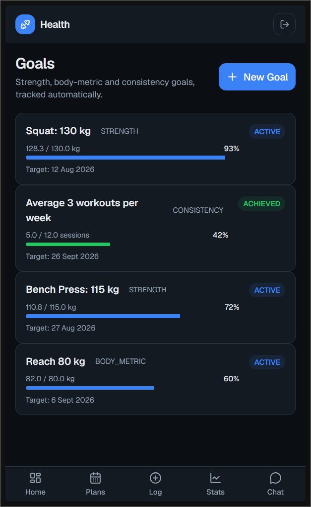

# Health — Workout Programming App

A self-hostable, mobile-first web app to **program and follow exercise routines toward a health goal**.

Define exercises → compose workouts → schedule them into weekly plans → log live sessions → track strength, consistency, and body-composition goals — all from your phone browser, with an AI coach to help you analyse data and create new content.

---

## Features

### Core app
- **Exercise library** — 90 seeded system exercises (filterable by muscle group & equipment); create and manage custom exercises with instructions and coaching notes
- **Workout builder** — ordered exercise lists with per-exercise targets (sets, reps, weight, rest); drag-to-reorder; superset grouping
- **Plans / routines** — weekly schedule (Mon–Sun → workout) over a date range; DRAFT → ACTIVE → COMPLETED lifecycle; "Today's Workout" on the dashboard; plan adherence tracking with multi-week streaks
- **Live session logging** — one-exercise-at-a-time logger; rest timer; per-set weight × reps; overall effort (RPE 1–10) on completion
- **Goals** — Strength (estimated 1RM via Epley formula), Body Metric (bodyweight/measurements), and Consistency (workouts/week) goal types with automatic progress tracking
- **Body metrics** — log bodyweight, waist, arms, and other measurements over time with trend charts
- **Analytics** — exercise progression, personal records, plan adherence / streaks with heatmap, volume by muscle group, body metric trends; muscle-group heatmap overlaid on an SVG body diagram
- **Dashboard** — today's scheduled workout, current weight, active goal progress bars, recent PRs, adherence snapshot, AI-generated personalized insights

### AI Coach (chatbot)
- Conversational AI coach accessible from the **Chat** tab — works with any OpenAI-compatible endpoint: cloud providers (Anthropic, OpenAI, Gemini) or fully local models (LM Studio, Ollama, etc.); supports multi-model selection per turn
- **Memory & personalization** — agent remembers durable facts about your fitness journey (injuries, equipment, schedule, goals) and proactively references them in future conversations
- **Read tools** — agent queries your real training data to answer questions ("What muscles am I neglecting?", "Show me squat progress", "What's my longest streak?")
- **Coaching tools** — synthesises multiple data sources to give proactive advice: training balance analysis, goal trajectory projection, next-workout recommendation, 4-week training summary
- **Ad-hoc session logging** — agent can log past sessions (atomic: all exercises at once) or start new sessions (live: hand off to native app UI for real-time logging)
- **Write tools** — agent creates workouts, training plans, goals, logs body metrics, and logs past/live workout sessions on your behalf after explicit confirmation ("Create a PPL split starting next Monday for 8 weeks" or "Log yesterday's gym session: 3×5 squats at 100kg, then 3×8 leg press")
- **Exercise creation** — agent can create custom exercises when explicitly asked

---

## UI Snapshots

**Dashboard** — today's workout, active goal progress, recent PRs, adherence snapshot, and AI insights



**Plans** — active training schedule (left) and completed plans with adherence streaks (right)

| | |
|---|---|
|  |  |

**Session logging** — live logging with rest timer and set tracking (left) and completed session summary (right)

| | |
|---|---|
|  |  |

**Analytics** — exercise progression, personal records, and body metric trends

| | |
|---|---|
|  |  |
|  | |

**Goal tracking** — view all active and completed goals with automatic progress calculation



---

## Showcase

### Training balance coaching
Ask the agent to analyze your training patterns. It queries your session history and muscle volume data, identifies imbalances, and then creates a new workout tailored to address them—all in one conversation.


### Goal-driven planning
Check your progress toward a goal, discuss your availability and preferences, and let the agent create a custom training plan. Review the plan in the app UI and activate it when ready.


### Memory across sessions + Live logging
Tell the agent about constraints (injuries, equipment, availability). In a fresh chat, ask it to log a workout. The agent remembers your constraints and proactively suggests modifications—like replacing a forbidden exercise with a safe alternative. Then hand off to the app's native logging screen to complete the session with supersets and real-time set tracking.


---

## Installation

### 1. Configure

```bash
cp .env.example .env
```

Edit `.env` and set the required values:

```env
# Required — generate with: openssl rand -base64 32
AUTH_SECRET="your-secret-here"

# Required for the AI coach — set to whichever provider/model you use
LLM_BASE_URL="https://api.anthropic.com"   # or OpenAI, Gemini, LM Studio, Ollama, etc.
LLM_API_KEY="your-api-key"
LLM_MODEL="claude-haiku-4-5-20251001"

# Required for the AI coach
INTERNAL_API_SECRET="another-random-secret"
```

See [.env.example](./.env.example) for the full list including embedding model settings.

### 2. Run

```bash
docker compose up -d
```

On first boot the container automatically applies database migrations and seeds the exercise library. Open [http://localhost:3000](http://localhost:3000) — the first account you register becomes the **admin**.

### 3. Lock down registration (recommended)

Once your account(s) are created, disable open sign-up so no one else can register:

```env
ALLOW_REGISTRATION=false
```

Then `docker compose up -d` to pick up the change.

### Backup & Recovery

All application data is stored in Docker named volume `db_data`. **Back up these files to prevent permanent data loss:**

| File | Contains | How to backup |
|------|----------|---|
| `app.db` | All user accounts, workouts, sessions, goals, metrics, custom exercises | Docker volume |
| `agent_kit.db` | AI agent factual memory (injuries, equipment, learned facts) | Docker volume |
| `.env` | Secrets and configuration (AUTH_SECRET, API keys, etc.) | Local file |
| `qdrant_data/` | [Optional] Cross-conversation memory embeddings (if `VECTOR_BACKEND=qdrant`) | Docker volume |

**Backup command (recommended: run daily):**

```bash
# Create timestamped backup directory
mkdir -p ./backups
TIMESTAMP=$(date +%Y%m%d_%H%M%S)

# Backup Docker volume (app.db, agent_kit.db, optional qdrant_data)
docker run --rm -v db_data:/data -v "$(pwd)/backups:/backup" \
  alpine tar czf "/backup/db_data_${TIMESTAMP}.tar.gz" -C /data .

# Backup .env (contains secrets)
cp .env "./backups/.env_${TIMESTAMP}"

echo "Backup saved to: ./backups/"
```

**Restore from backup:**

```bash
# Extract volume backup
docker compose down
docker volume rm db_data
docker volume create db_data

docker run --rm -v db_data:/data -v "$(pwd)/backups:/backup" \
  alpine tar xzf "/backup/db_data_TIMESTAMP.tar.gz" -C /data

# Restore .env
cp "./backups/.env_TIMESTAMP" .env

docker compose up -d
```

**Note:** System exercises and database schema auto-restore from migrations on startup, so you only need to preserve the three items above.

### Changing the port

Set `PORT=8080` (or any port) in `.env` and restart.

---

## Multi-user

The app is multi-user by default — each account has fully isolated data. The **Admin panel** at `/admin` (visible to the first registered user) lets you manage accounts: change passwords, delete users, reset data, grant/revoke admin.

---

## Tech Stack

| Concern | Choice |
|---|---|
| Framework | Next.js 16 (App Router) + React 19 + TypeScript |
| Database | SQLite via Prisma 7 + `better-sqlite3` |
| Auth | Auth.js (NextAuth v5) — email/password, JWT sessions, bcrypt |
| Styling | Tailwind CSS v4, lucide-react |
| Charts | Recharts + react-body-highlighter (SVG muscle maps) |
| AI sidecar | Python (FastAPI + [`agent_kit`](https://github.com/sharma-n/agent_kit)) |

---

## Contributing / Local Development

See [SPEC.md](./SPEC.md) for the full architecture and [SPEC_agent.md](./SPEC_agent.md) for the AI coach design.

```bash
npm install
cp .env.example .env   # set AUTH_SECRET at minimum
npm run db:deploy       # apply migrations
npm run db:seed         # seed exercise library
npm run dev             # http://localhost:3000
```

AI sidecar (separate terminal):
```bash
cd agent_service
uv sync
uv run uvicorn health_agent.main:app --reload --port 8000
```

To customize the AI coach's behavior, system prompt, or available tools, edit `agent_service/config.yaml` — changes take effect on the next request (no restart needed).
